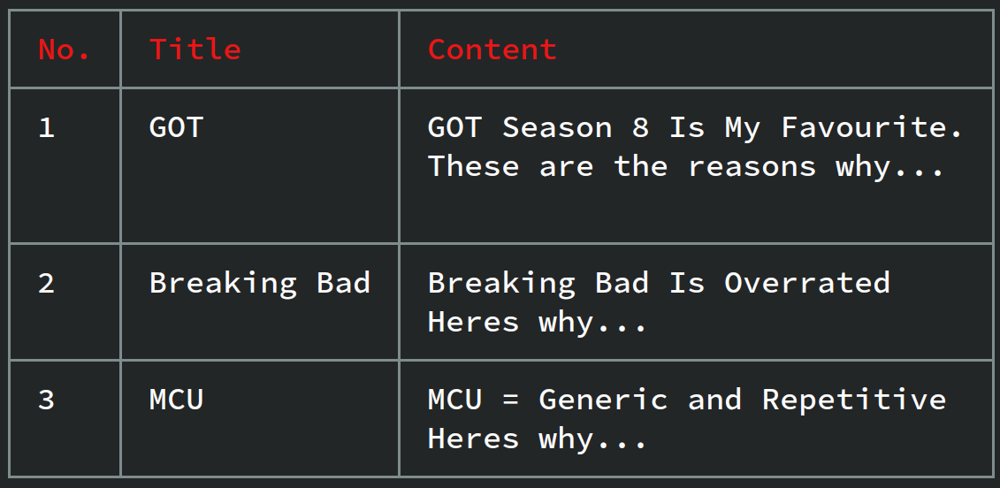
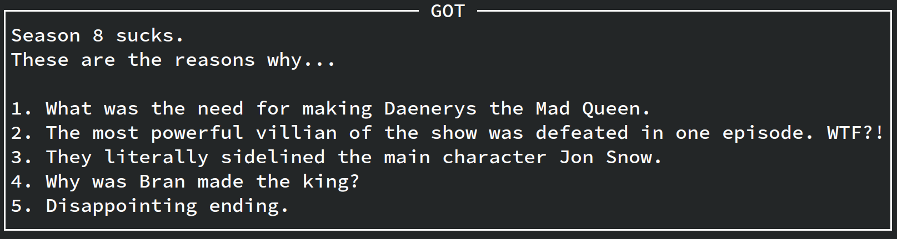

# Notes Manager CLI

## Table of Contents
- [Introduction](#introduction)
- [Features](#features)
- [Installation](#installation)
- [Usage](#usage)
- [Commands](#commands)

## Introduction
Notes Manager CLI is a command-line interface tool designed to help you manage your notes efficiently. It allows you to create, read, update, and delete notes directly from your terminal.

## Features
- Create new notes
- List all notes
- View a specific note
- Update existing notes
- Delete notes

## Installation

### Method 1: Installation via npm

To install Notes Manager CLI via npm, run the following command:

```sh
npm install -g @pujan2412/notes-manager-cli
```

<br/>

### Method 2: Installation via github
To install Notes Manager CLI, follow these steps:

1. Clone the repository:
  ```sh
  git clone https://github.com/Pujan-khunt/Simple-Notes-Manager-CLI
  ```
2. Navigate to the project directory:
  ```sh
  cd Simple-Notes-Manager-CLI
  ```
3. Install the required dependencies:
  ```sh
  npm install
  ```
4. Link the CLI tool globally:
  ```sh
  npm link
  ```

<br/>

## Usage
After installation, you can use the `nman` command followed by various subcommands to manage your notes.

<br/>

### Example:
```sh
nman create "My Linear Algebra Notes"
Note Created Successfully # Output of the above command
```

<br/>

## Commands

### 1. Creating Notes
---
The command to create a note is 
```bash
nman create <name>
Note Created Successfully # Output of the above command
```
1. This will open the default editor which is set in your system, it will default to '_Visual Studio Code_' if default editor is not set, and will default to '_Vim_' if '_Visual Studio Code_' doesn't exist, and if '_Vim_' doesn't exist then it will choose '_Nano_'.

2. After you enter the content just close the file to save it.

3. You will recieve the message 'Note created successfully' in green color.

 You can also use the '-m' flag to provide the content directly while creating the note.

#### Syntax of creating a note using -m
```bash
nman create <name> -m "<content>"
Note Created Successfully # Output of the above command
```

<br/>

### 2. Updating Notes
---
The command to update a note is
```bash
nman update <name>
Note Updated Successfully # Output of the above command
```

1. This will open the default editor which is set in your system, it will default to '_Visual Studio Code_' if default editor is not set, and will default to '_Vim_' if '_Visual Studio Code_' doesn't exist, and if '_Vim_' doesn't exist then it will choose '_Nano_'.

2. After you update the content just close the file to save it.

3. You will recieve the message 'Note Updated Successfully' in green color.

You can also use the '-m' flag to provide the content directly while updating the note.

__NOTE: if you use the -m flag the provided content will overwrite the existing content. So use only when necessary.__

#### Syntax of updating a note using -m 
```bash
nman update <name> -m "<content>"
Note Updated Successfully # Output of the above command
```

<br/>

### 3. Reading Notes
---
#### 1. Reading All the Notes
the command for reading all the notes is
```bash
nman list
```

Output Of the Above Command


This command will list all the lists in a table format (No., Note, Content)

__NOTE: This command is only meant to view which notes are present.
To fully view note use the command mentioned below (Reading a specific note).__

---

#### 2. Reading a Specific Note
The command for reading a specific note is...
```bash
nman list <name>
```

Output of the above command


This command will display the contents of a specific note.

<br/>

### 4. Deleting Notes
---
#### 1. Deleting a Specific Note
The command to delete a specific note is...
```bash
nman delete <name>
Note Deleted Successfully # Output of the above command
```

This command will delete the note.

__NOTE: This is an irreversible process. Once deleted it cannot be retrieved back.__

---

#### 2. Deleting All Notes
The command to delete all notes is
```bash
nman clear
Cleared All The Notes. # Output of the above command
```

This command will clear out every single note.
__NOTE: This is an irreversible process. Once deleted it cannot be retrieved back.__